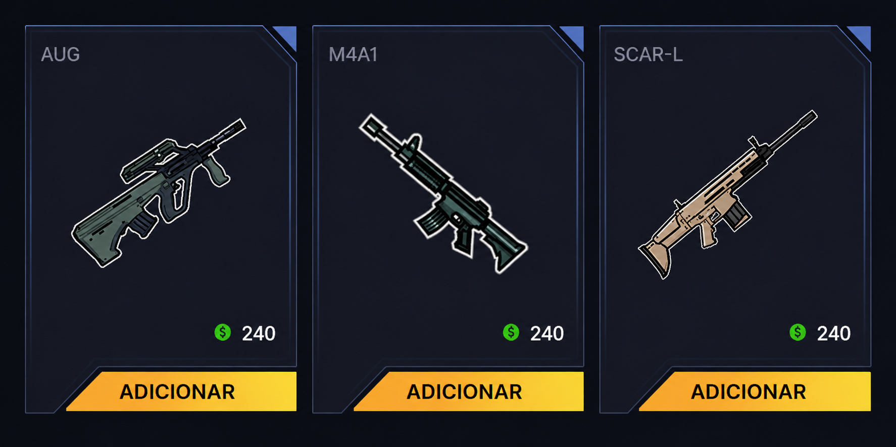

# 📓 GOT | Curso

O Grupamento é responsável pela instrução dos demais oficiais, buscando capacitá-los para o uso dos armamentos disponibilizados pelo Batalhão. Durante os cursos, além da familiarização com o armamento, também buscamos instruir os oficiais quanto a diferentes cenários do dia a dia, sejam eles ações ou situações que possam ocorrer durante o patrulhamento.

Essas instruções ocorrem por meio do CTO (Curso Tático Operacional). Atualmente, os CTOs são subdivididos em:

## Curso Tático Classe I


Armamentos liberados após conclusão do CTO I.


<figure><figcaption></figcaption></figure>

## Curso Tático Classe II


Armamentos liberados após conclusão do CTO II.


<figure><figcaption></figcaption></figure>

## Curso Tático Classe III


Armamentos liberados após conclusão do CTO III.


<figure><figcaption></figcaption></figure>

## Curso Tático Classe IV


Armamentos liberados após conclusão do CTO IV.


<figure><figcaption></figcaption></figure>


Qualquer mau uso do equipamentos estará sujeito a revogação do porte.



Em caso de reciclagem de algum curso, será analisado tambem a reciclagem dos CTOs.

