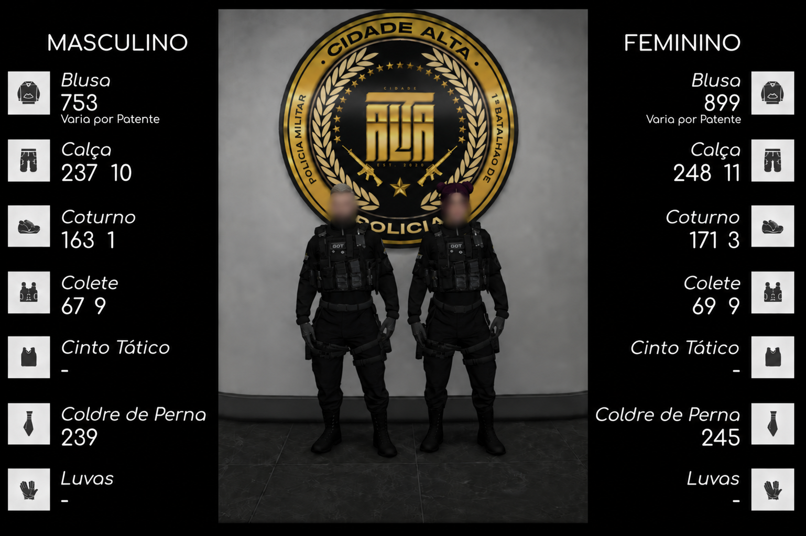
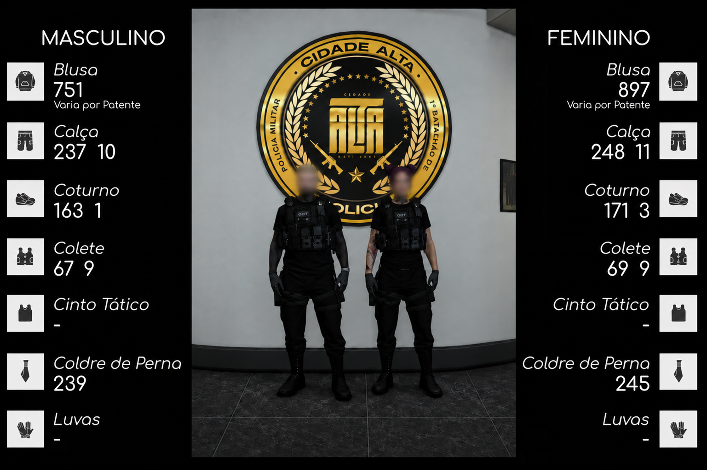
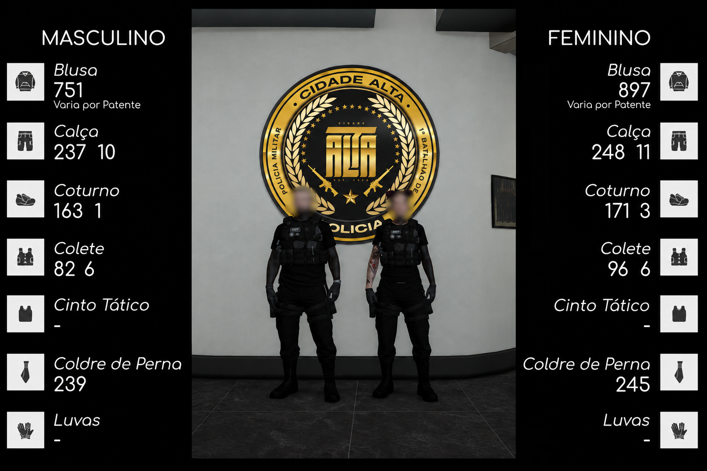
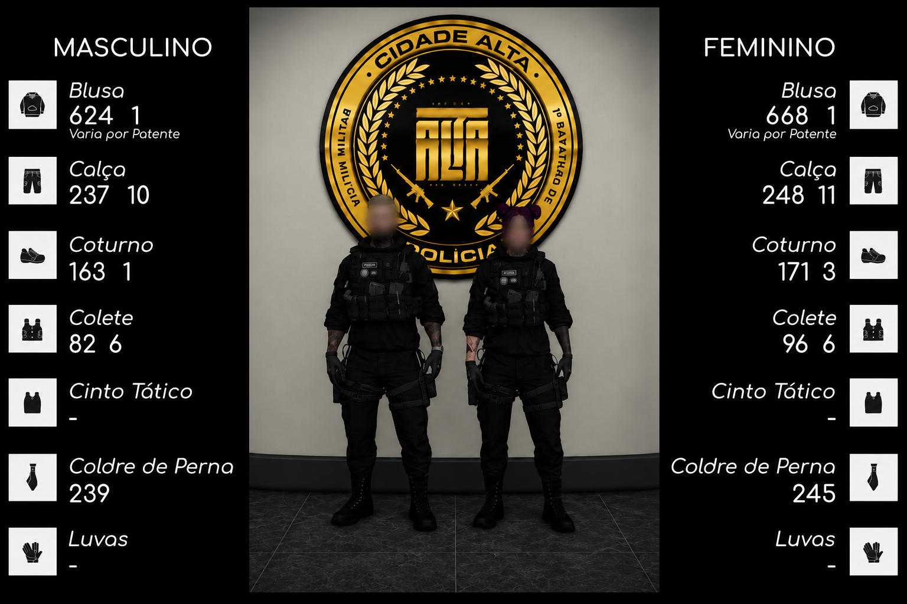

# 👕 Fardamentos

## Estagiários

<figure><figcaption></figcaption></figure>


Mantem-se o padrão de maneira que é PROIBIDO o uso de QUALQUER adorno, sendo o único opcional o uso de luvas PRETAS.


## Operador

<figure><figcaption></figcaption></figure>


Mantem-se o padrão, com o uso de adornos LIBERADOS desde que mantenham o padrão policial.


## Operador veterano

<figure><figcaption></figcaption></figure>


Mantem-se o padrão, com o uso de adornos LIBERADOS desde que mantenham o padrão policial.


## Operador Sênior

<figure><figcaption></figcaption></figure>


Mantem-se o padrão, com o uso de adornos LIBERADOS desde que mantenham o padrão policial.




<mark style="color:orange;">O grupamento possui autorização para o uso de máscaras que ocultem a face do operador, das máscaras com identificação do grupamento, além da tradicional máscara de caveira.</mark>



<mark style="color:orange;">O uso do colete balístico é OBRIGATÓRIO, com a exceção para o comando e braços direitos.</mark>



